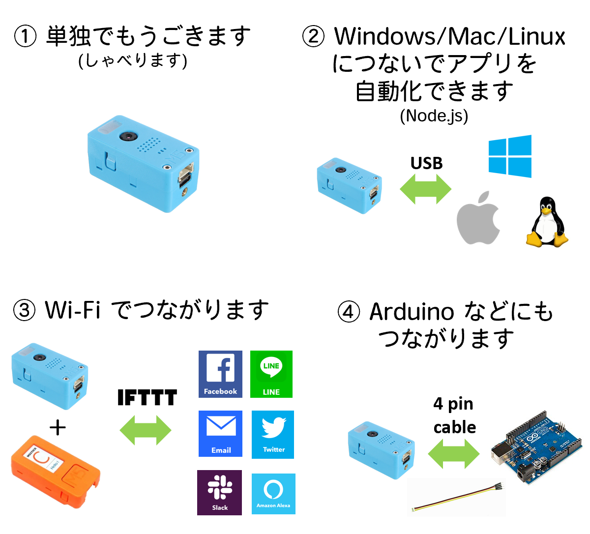

# Brownie TMMF 2020
Tsukuba Mini Maker Faire 2020 で頒布した Brownie の使い方ドキュメントです。関連ファイル一式が[Tsukuba Mini Maker Faire 2020 Kit](https://github.com/ksasao/brownie/releases/tag/v2.1)にあります。

## Brownie とは
Brownie は QRコードを使って簡単に画像を学習し、その画像に応じてさまざまな動作をさせることができる AI カメラです。カメラ単独でも利用できるほか、Windows / Mac / Linux / Raspberry Pi のコマンドの実行、IFTTT連携もでき、Arduino などにもつながります。
- [使い方の例](https://twitter.com/ksasao/status/1160532010856665089)
- [学習方法](https://twitter.com/ksasao/status/1161978500091301893)
- [TMMF 2020 プレゼン資料: AIカメラで簡単に生活を便利にする](https://speakerdeck.com/ksasao/aikameradejian-dan-nisheng-huo-wobian-li-nisuru-number-tmmf2020)

## 内容物
1. M5StickV ([maixpy_v0.5.0_9_g8eba07d_m5stickv.bin](http://dl.sipeed.com/MAIX/MaixPy/release/master/maixpy_v0.5.0_9_g8eba07d) 導入済み)
2. Lexar microSDHC 32GB (Brownie書き込み済みのものが M5StickVに挿入されています)
3. M5StickC (WiFiアプリケーション書き込み済み)
4. USB type-C ケーブル
5. WiFi接続ケーブル
6. [GROVE - 4ピン-ジャンパメスケーブル](https://www.switch-science.com/catalog/1048/) ([ピンヘッダ](http://akizukidenshi.com/catalog/g/gC-09056/) 8本分を含む)
7. [QRコードカード](https://github.com/ksasao/brownie/tree/master/src/brownie_learn/QR) (10枚組)

なお、WiFi接続ケーブルは以下のように配線されています。
|M5StickV|M5StickC(Hat側)|
|:-------:|:--------:|
|黄 *1 (RX)|G0 (TX)|
|白 *1 (TX)|G36 (RX)|
|赤 (VCC)|→5V|
|黒 (GND)|GND|

*1 M5Stack製の場合。Seeed製Grove純正ケーブルの場合は、黄と白の配線が逆になっています。

## 利用準備
### a) M5StickV 単独で利用する場合
1. microSDHC カードが M5StickV にきちんと挿入されていることを確認し、 USB type-C ケーブルを接続します。ケーブルの他方は PC、モバイルバッテリー、USB充電器などに接続して給電を行います。給電を開始するとすぐに起動して、__Brownie__ のタイトル画面が表示され、数秒待つとカメラ画像(画面左上に数字)が表示されます。うまく表示されない場合は、10分程度充電を行ったのち、microSDカード側にあるボタン(電源ボタン)を6秒程度長押ししてください。
2. QRコードカードをカメラにかざします。「カメラを向けてください」の音声ガイドとともに画面上に赤い枠が数秒間表示されるので、その間に学習したい対象にカメラを向けます。撮影が完了すると「データを登録しました」という音声が流れます。利用方法は[この動画](https://twitter.com/ksasao/status/1161978500091301893)を参照してください。
    * 「グー(gu)」「チョキ(choki)」「パー(pa)」「戻して(modoshite)」「ヒト(person)」のカードはそのまま学習に利用できます。
    * 「学習データをリセットします(*reset)」カードをかざすと、学習したデータがすべて消去されます。
    * 「0」「100」のカードをかざすと2枚の画像を基準として映っているものを数値化します。利用方法は、[この動画](https://twitter.com/ksasao/status/1185909464471232512)を参照してください。
    * 「対象を除外します(*exclude)」を利用すると、撮影対象を無視することができます。誤判定してしまう場合に利用してください。
3. 独自のQRコードを利用することもできます。スマートフォンでは[QRer](https://shinoharata.github.io/QRer/)、PCでは[QR Code Generator](https://www.the-qrcode-generator.com/)が便利です。英数記号が利用できます。日本語や絵文字などは利用できません。なお、[リスト](voice.tsv)に記載のある英数字を利用すると、音声も流れます。
4. 終了するには、USBケーブルを抜き、microSDカード側にあるボタン(電源ボタン)を長押ししてください。長押ししても電源が切れない場合は、10～15分程度放置してまた電源ボタンを押してください。なお、給電したままでは電源を切ることができません。

### b) Windows / Mac / Linux / Raspberry Pi に接続して利用する
USB ケーブルをPC等に接続することで、各OSのコマンドを実行することができます。詳細は、[BrownieMonitorNodeJs](https://github.com/ksasao/brownie/tree/master/tool/BrownieMonitor/BrownieMonitorNodeJs) を参照してください(英語)。

### c) Wi-Fi と IFTTT に接続して利用する
Wi-Fi経由で IFTTT の Webhooks が利用できます。Webhooks で LINE や Twitter などと連携することができます。IFTTT の利用方法については、[これらの記事](https://www.google.co.jp/search?q=ifttt+webhook+line&ie=UTF-8&oe=)等を参照してください。WebHookを利用するためには、Key が必要ですので、その文字列をメモしておいてください。

1. M5StickC (オレンジ色) に USB type-C ケーブルを接続し 30分程度充電してください。表示部に __WiFi error__ と表示されますが正常です。この作業を行わないと動作が不安定になります。
2. 1.の作業が完了したら、M5StickC(オレンジ色)からUSBケーブルを抜き、M5StickVにUSBケーブルを接続します。
3. M5StickV (水色)に WiFi接続ケーブルをつなぎ、さらにそれを M5StickC (オレンジ色)につなぎます。
4. 以下のような文字列をテキストエディタなどを用いて作成し、[QR Code Generator](https://www.the-qrcode-generator.com/)などを利用して、QRコードに変換します。WiFiのSSIDとパスワードの部分には接続したいWiFi機器の情報を入力してください。なお、2.4GHz帯のみ対応しています。
    > {"ssid":"<WiFiのSSID>", "pass":"<WiFiのパスワード>", "ifttt":"<IFTTTのKey>"}
5. 4.で作成したQRコードを M5StickV にかざすと、Wi-Fi の接続情報と、IFTTTの Key が M5StickC に書き込まれます。M5StickC に __Connected.__ と表示されれば正常です。表示されない場合には、M5StickCの電源(M5と書かれている部分のM側の側面)を長押しして入れなおしてください。 
6. M5StickV に学習した物体をかざすと、IFTTTに対し、以下ようなURLでGETリクエストが発行されます。
    > https://maker.ifttt.com/trigger/<QRコードの文字列>/with/key/<IFTTTのKey>

### d) GROVE - 4ピン-ジャンパメスケーブル の利用
WiFi接続ケーブルの代わりに [GROVE - 4ピン-ジャンパメスケーブル](https://www.switch-science.com/catalog/1048/) を利用することができます。必要に応じて、同梱されているピンヘッダをニッパなどで加工して利用してください。Seeed製Groveケーブルの色の意味は下記の通りです。

|色|意味|
|:---:|:---:|
|赤|5V|
|黒|GND|
|白|TX *2|
|黄|利用しません|

*2 115200 bps, パリティなし, 8データビット, 1ストップビット、改行コードが含まれない\0終端で出力されます。

Arduino Leonardo 向けの[サンプルスケッチ](https://github.com/ksasao/brownie/tree/master/src/brownie_learn/4pinSerial/ArduinoLeonardoSample)も合わせて参照してください(Arduino Leonardo は別途購入願います)。

## お問い合わせ
お問い合わせは [@ksasao](https://twitter.com/ksasao) またはメール ksasao@gmail.com までお願いいたします。